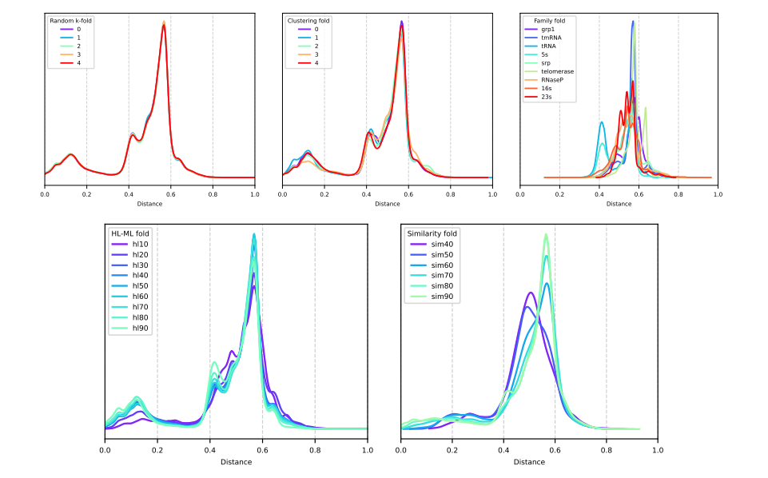
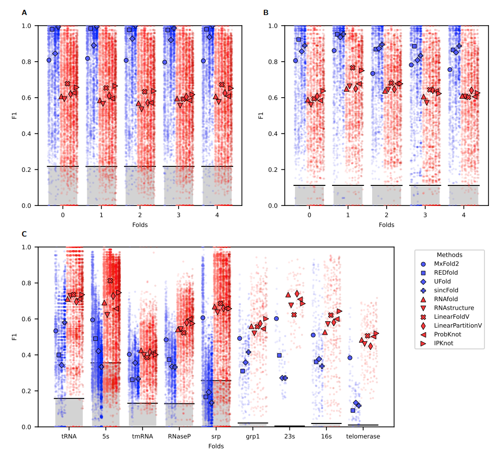
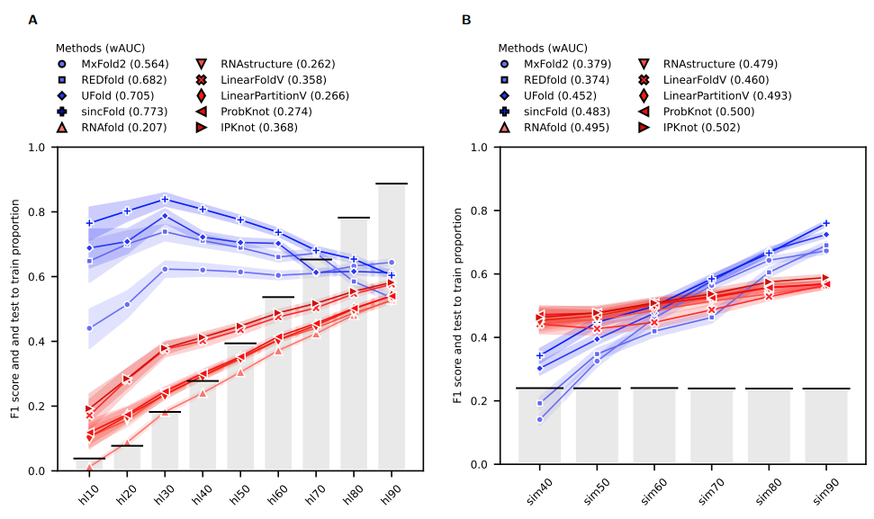
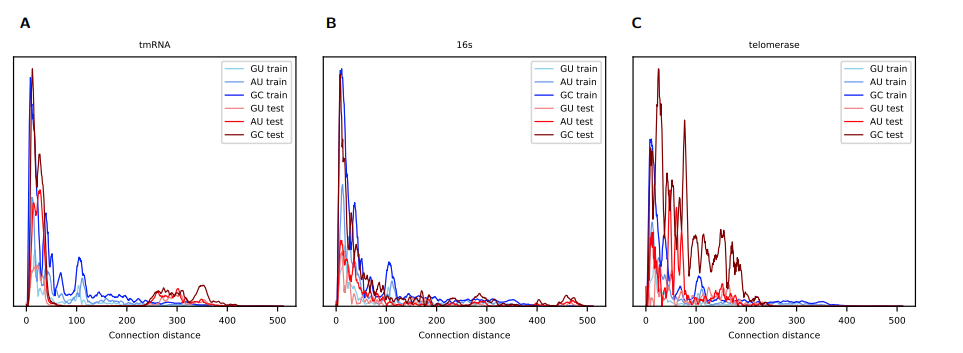

# Revisiting homology-aware cross validations for RNA secondary structure prediction

This repository contains the data and source code for the manuscript *Revisiting homology-aware cross validations for RNA secondary structure prediction*, by L.A. Bugnon, G. Kulemeyer, M. Gerard, L. Di Persia, G. Stegmayer and D.H. Milone, 2025 (under review). Research Institute for Signals, Systems and Computational Intelligence, [sinc(i)](https://sinc.unl.edu.ar/).

In this work we revise existing cross-validation strategies for RNA secondary structure prediction: random k-fold, clustering fold and family fold. 

We explain and analyze in detail the advantages and disadvantages of each one of them, additionally proposing two novel evaluation methodologies for testing: human-learned fold and similarity fold. 

All validation strategies are applied to state-of-the-art methods for RNA secondary structure prediction and comparative results are analyzed.

## Reproducing experimental results
### Distribution of structural distances
[This notebook](https://colab.research.google.com/github/sinc-lab/revisiting_crossval_rnafolding/blob/main/src/Figure_1_Distance_distributions.ipynb) reproduces the analysis of the distributions of testing to training structural distances for the different cross-validation strategies analyzed.

### Performance comparison on RNA folding
[This notebook](https://colab.research.google.com/github/sinc-lab/revisiting_crossval_rnafolding/blob/main/src/Figure_2_and_4_Methods_performance_comparisons.ipynb) shows the performance comparison among different cross-validation strategies that can be found in literature

 Performance comparison among different cross-validation strategies that can be found in literature. A) random $k$-fold; B) clustering fold; C) fam-fold. 

 Performance comparison of mean performance with 95% confidence interval in A) human learned fold; B) similarity fold.

[This notebook](https://colab.research.google.com/github/sinc-lab/revisiting_crossval_rnafolding/blob/main/src/Figure_3_Distribution_canonical_connections_distances.ipynb) reproduces the comparison of distribution of canonical connections (GC, AU and GU) in 3 folds of the family fold.

