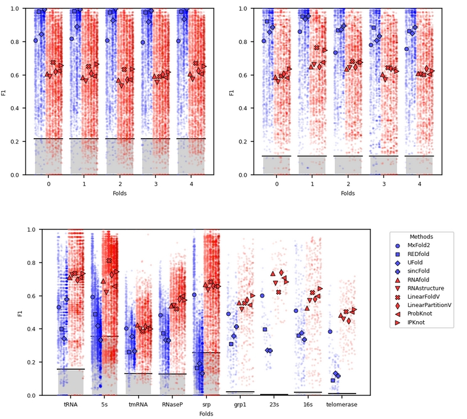
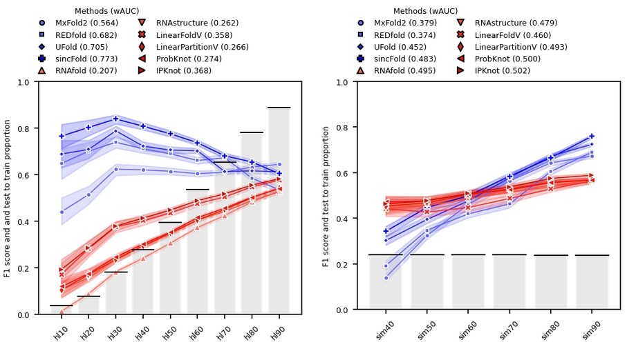

# Revisiting homology-aware cross validations for RNA secondary structure prediction

This repository contains the data and source code for the manuscript *Revisiting homology-aware cross validations for RNA secondary structure prediction*, by L.A. Bugnon, G. Kulemeyer, M. Gerard, L. Di Persia, G. Stegmayer and D.H. Milone, 2025. Research Institute for Signals, Systems and Computational Intelligence, [sinc(i)](https://sinc.unl.edu.ar/).

In this work we revise existing cross-validation strategies for RNA secondary structure prediction: random k-fold, clustering fold and family fold. 

We explain and analyze in detail the advantages and disadvantages of each one of them, additionally proposing two novel evaluation methodologies for testing: hl-ml fold and similarity fold. 

All validation strategies are applied to state-of-the-art methods for RNA secondary structure prediction and comparative results are analyzed.

The following notebooks reproduce the figures of the manuscript:

- [Reproducing Figure 1](https://colab.research.google.com/github/sinc-lab/revisiting_crossval_rnafolding/blob/main/Figure_1_Distance_distributions.ipynb)
- [Reproducing Figure 2](https://colab.research.google.com/github/sinc-lab/revisiting_crossval_rnafolding/blob/main/Figure_2_and_4_Methods_performance_comparisons.ipynb)
- [Reproducing Figure 3](https://colab.research.google.com/github/sinc-lab/revisiting_crossval_rnafolding/blob/main/Figure_3_Distribution_canonical_connections_distances.ipynb)
- [Reproducing Figure 4](https://colab.research.google.com/github/sinc-lab/revisiting_crossval_rnafolding/blob/main/Figure_2_and_4_Methods_performance_comparisons.ipynb)
